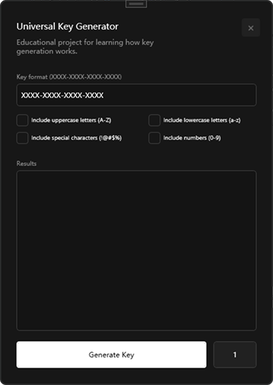

# Universal Key Generator

A simple WPF application for generating custom keys/passwords. Coded and designed for learning purposes

## Features
- Generate keys based on a custom format (e.g. XXXX-XXXX-XXXX)
- Select character types: lowercase, uppercase, numbers and special characters
- Generate multiple keys/passwords at once
- Modern UI (inspired by shadcn ui lib, coded by me)
- Error notifications for invalid input

## Screenshots

## Future Plans
- Add adaptive/responsive design for different window sizes
- Add a "Copy All Keys" button to quickly copy all generated keys
- Add minimize button
